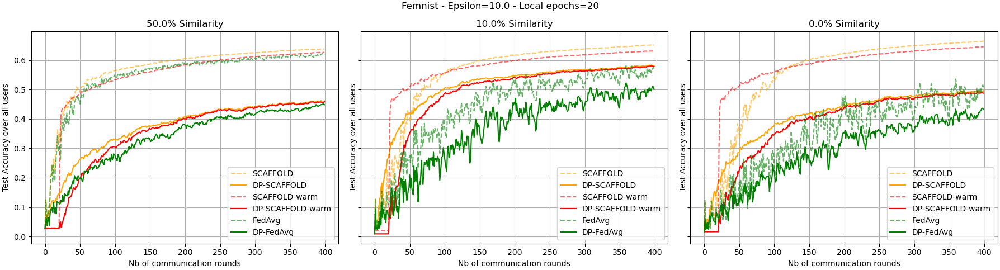
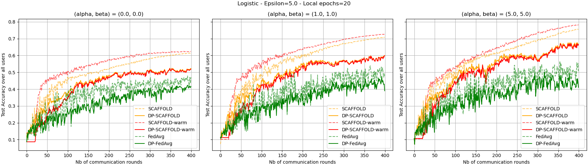

# **Differential Privacy for Heterogeneous Federated Learning : Utility \& Privacy tradeoffs**

In this work, we propose an algorithm DP-SCAFFOLD(-warm), which is a new version of the so-called SCAFFOLD algorithm (
warm version : wise initialisation of parameters), to tackle heterogeneity issues under mathematical privacy constraints
known as ``Differential Privacy`` (DP) in a federated learning framework. Using fine results of DP theory, we have
succeeded in establishing both privacy and utility guarantees, which show the superiority of DP-SCAFFOLD over the naive
algorithm DP-FedAvg. We here provide numerical experiments that confirm our analysis and prove the significance of gains
of DP-SCAFFOLD especially when the number of local updates or the level of heterogeneity between users grows.

Two datasets are studied :

- a real-world dataset called ``Femnist`` (an extended version of EMNIST dataset for federated learning)

- synthetic data called ``Logistic`` for logistic regression models

Significant results are available for both of these datasets for logistic regression models.

# Structure of the code

- `main.py` : four global options are available.
    - `generate` : to generate data (only `Logistic`), introduce heterogeneity, split data between users for federated
      learning and preprocess data
    - `optimum` : to save the best model in a centralized setting (after `generate`)
    - `simulation` : to run simulations of federated learning (after `generate` and `optimum`)
    - `plot` : to plot visuals (after `simulation`)

## ./data

Contains generators of synthetic (`Logistic`) and real-world (`Femnist`) data (
file `data_generator.py`), designed for a federated learning framework under some similarity parameter. Each folder
contains a file `data` where the generated data (`train` and `test`) is stored.

## ./flearn

- [differential_privacy](flearn/differential_privacy) : contains code to apply Gaussian mechanism (designed to add
  differential privacy to stochastic gradients)
- [optimizers](flearn/optimizers) : contains the optimization framework for each algorithm (adaptation of gradient
  descent)
- [servers](flearn/servers) : contains the super class `Server` (in `server_base.py`) which is adapted to FedAvg and
  SCAFFOLD (algorithm from the point of view of the server)
- [trainmodel](flearn/trainmodel) : contains the learning model structures
- [users](flearn/users) : contains the super class `User` (in `user_base.py`) which is adapted to FedAvg and SCAFFOLD (
  algorithm from the point of view of any user)

## ./models

Stores the latest models over the training phase of federated learning.

## ./results

Stores several metrics of convergence for each simulation, each similarity/privacy setting and each algorithm.

Metrics (evaluated at each round of communication):

- test accuracy over all users
- train loss over all users
- highest norm of parameter difference (server/user) over all selected users
- train gradient dissimilarity over all users

# Software requirements:

- To download the dependencies: **pip install -r requirements.txt**

# References

- Code (main structure): https://github.com/ramshi236/Accelerated-Federated-Learning-Over-MAC-in-Heterogeneous-Networks
- Code (utils : per-example gradients): https://github.com/cybertronai/autograd-hacks/blob/master/autograd_hacks.py
- SCAFFOLD & FedAvg : https://arxiv.org/abs/1910.06378
- Generation of Logistic data : https://arxiv.org/abs/1812.06127
- Creation of dissimilarity for FEMNIST data : https://arxiv.org/abs/1909.06335

