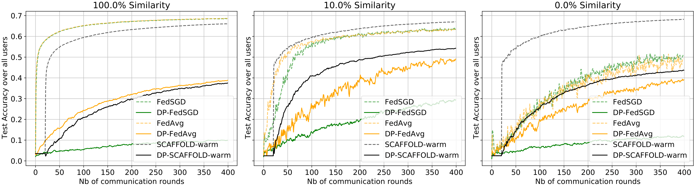
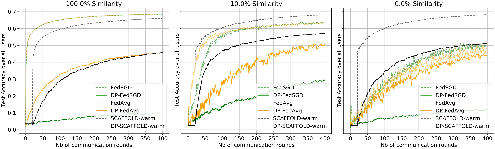
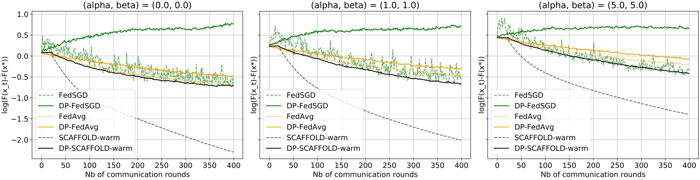
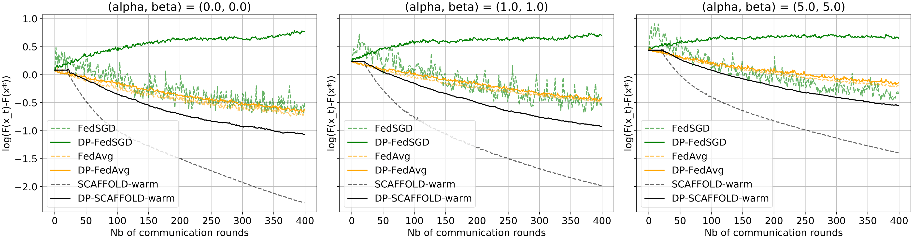

# **Differential Privacy for Heterogeneous Federated Learning : Utility \& Privacy tradeoffs**

In our paper, we propose an algorithm DP-SCAFFOLD(-warm), which is a new version of the so-called SCAFFOLD algorithm (
warm version : wise initialisation of parameters), to tackle heterogeneity issues under mathematical privacy constraints
known as ``Differential Privacy`` (DP) in a federated learning framework. Using fine results of DP theory, we have
succeeded in establishing both privacy and utility guarantees, which show the superiority of DP-SCAFFOLD over the naive
algorithm DP-FedAvg. We here provide numerical experiments that confirm our analysis and prove the significance of gains
of DP-SCAFFOLD especially when the number of local updates or the level of heterogeneity between users grows.

Two datasets are studied in the paper:

- Real-world data,``Femnist``, (an extended version of EMNIST dataset for federated learning), which you see the
  Accuracy growing with the number of communication rounds (50 local updates first and then 100 local updates) under the
  same DP framework for the algorithms.

- Synthetic data, ``Logistic``, for logistic regression models, which you see the train loss decreasing with the number
  of communication rounds (50 local updates first and then 100 local updates),under the same DP framework for the
  algorithms.

Significant results are available for both of these datasets for logistic regression models in the paper.

Remark that the code may be run on other real-world datasets: `CIFAR_10` (but not stable on GPU...) and `Mnist`.

# Structure of the code

- `main.py`: five global options (mutually exclusive) are available, once the parameters are given.
    - `generate`: to generate data, introduce heterogeneity, split data between users for federated learning and
      preprocess data. Remark there is the option `generate_pca` which enables to reduce the dimension of the input data
      by applying a non-private PCA from the whole dataset (combined with `dim_pca`, not available on `Logistic`
      dataset).
    - `optimum` (after `generate`): to run the training phase of a model with "unsplitted" data (that is centralized
      dataset) and save the empirical model with the lowest train loss to properly compute the gap train log-loss.
    - `tuning` (after `optimum`): to run 5-fold cross-validation with the selected model, given multiple values of local
      learning rate (fill the variable `local_learning_rate_list`). The results are stored in the
      folder `results_tuning`.
    - `simulation` (after `tuning`): to run several simulations of federated learning once the best local learning rate
      is determined and save the results (accuracy, loss...). This option calls `simulate.py`.
    - `plot` (after `simulation`): to plot visuals.
- `get_epsilon_bound.py`: to design the scale of the Gaussian DP noise from the input parameters (relying on RDP upper
  bounds).

## ./data

Contains generators of synthetic (`Logistic`) and real-world (`Femnist`, `Mnist`, `CIFAR_10`) data, generated from the
local file `data_generator.py`, designed for a federated learning framework under some similarity parameter. Each folder
contains a file `data` where the generated data (`train` and `test`) is stored.

## ./flearn

- [differential_privacy](flearn/differential_privacy) : contains code to apply Gaussian mechanism (designed to add
  differential privacy to mini-batch stochastic gradients).
- [optimizers](flearn/optimizers) : contains the optimization framework for each algorithm (adaptation of stochastic
  gradient descent).
- [servers](flearn/servers) : contains the super class `Server` (in `server_base.py`) which is adapted to FedAvg and
  SCAFFOLD (algorithm from the point of view of the server).
- [trainmodel](flearn/trainmodel) : contains the learning model structures (`MclrLogistic` for logistic
  regression, `NN1` for neural network with one hidden layer, `NN1_PCA` with PCA on the input with the previous model, `CNN`)
- [users](flearn/users) : contains the super class `User` (in `user_base.py`) which is adapted to FedAvg and SCAFFOLD (
  algorithm from the point of view of any user).

## ./models

Stores the latest models over the training phase of federated learning.

## ./results

Stores several metrics of convergence for each simulation, each similarity/privacy setting and each algorithm.

Metrics (evaluated at each round of communication):

- test accuracy over all users,
- train loss over all users,
- highest norm of parameter difference (server/user) over all selected users,
- train gradient dissimilarity over all users.

# Software requirements:

- To download the dependencies: **pip install -r requirements.txt**.

# References

- Code (main structure): https://github.com/ramshi236/Accelerated-Federated-Learning-Over-MAC-in-Heterogeneous-Networks
- Code (utils/autograd_hacks.py): https://github.com/cybertronai/autograd-hacks/blob/master/autograd_hacks.py
- SCAFFOLD & FedAvg paper: https://arxiv.org/abs/1910.06378
- Generation of Logistic data and introduction of heterogeneity: https://arxiv.org/abs/1812.06127
- Creation of dissimilarity for FEMNIST data: https://arxiv.org/abs/1909.06335
